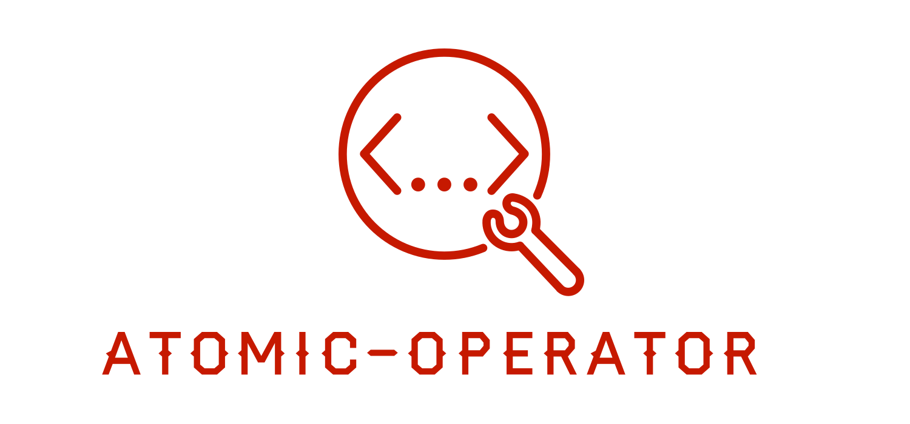

[](https://github.com/swimlane/atomic-operator/actions/workflows/ubuntu.yml) 
[](https://github.com/swimlane/atomic-operator/actions/workflows/windows.yml) 
[](https://github.com/swimlane/atomic-operator/actions/workflows/macos.yml) 


# atomic-operator



This python package is used to execute Atomic Red Team tests (Atomics) across multiple operating system environments.

> Current Version: v0.4.0 ([What's new?](release-notes.md))

## Why?

`atomic-operator` enables security professionals to test their detection and defensive capabilities against prescribed techniques defined within [atomic-red-team](https://github.com/redcanaryco/atomic-red-team). By utilizing a testing framework such as `atomic-operator`, you can identify both your defensive capabilities as well as gaps in defensive coverage.

Additionally, `atomic-operator` can be used in many other situations like:

- Generating alerts to test products
- Testing EDR and other security tools
- Identifying way to perform defensive evasion from an adversary perspective
- Plus more.

## Features

* Support local and remote execution of Atomic Red Teams tests on Windows, macOS, and Linux systems
* Supports running atomic-tests against `iaas:aws`
* Can prompt for input arguments but not required
* Assist with downloading the atomic-red-team repository
* Can be automated further based on a configuration file

## Getting Started

`atomic-operator` is a Python-only package hosted on [PyPi](https://pypi.org/project/atomic-operator/) and works with Python 3.6 and greater.

If you are wanting a PowerShell version, please checkout [Invoke-AtomicRedTeam](https://github.com/redcanaryco/invoke-atomicredteam).

```bash
pip install atomic-operator
```

The next steps will guide you through setting up and running `atomic-operator`.

* [Get Atomics](docs/atomics.md) Install / clone Atomic Red Team repository
* [atomic-operator](docs/atomic-operator.md) Understand the options availble in atomic-operator
* [Running Test on Command Line](docs/running-tests-command-line.md) or [Running Tests within a Script](docs/running-tests-script.md)

## Installation

You can install **atomic-operator** on OS X, Linux, or Windows. You can also install it directly from the source. To install, see the commands under the relevant operating system heading, below.

### Prerequisites

The following libraries are required and installed by atomic-operator:

```
pyyaml==5.4.1
fire==0.4.0
requests==2.26.0
attrs==21.2.0
```

### macOS, Linux and Windows:

```bash
pip install atomic-operator
```

### Installing from source

```bash
git clone https://github.com/swimlane/atomic-operator.git
cd atomic-operator
python setup.py install
```

## Usage example (command line)

You can run `atomic-operator` from the command line or within your own Python scripts. To use `atomic-operator` at the command line simply enter the following in your terminal:

```bash
atomic-operator --help
```

### Retrieving Atomic Tests

In order to use `atomic-operator` you must have one or more [atomic-red-team](https://github.com/redcanaryco/atomic-red-team) tests (Atomics) on your local system. `atomic-operator` provides you with the ability to download the Atomic Red Team repository. You can do so by running the following at the command line:

```bash
atomic-operator get_atomics 
# You can specify the destination directory by using the --destination flag
atomic-operator get_atomics --destination "/tmp/some_directory"
```

### Running Tests Locally

In order to run a test you must provide some additional properties (and options if desired). The main method to run tests is named `run`.

```bash
# This will run ALL tests compatiable with your local operating system
atomic-operator run --atomics-path "/tmp/some_directory/redcanaryco-atomic-red-team-3700624"
```

### Running Tests Remotely

In order to run a test remotely you must provide some additional properties (and options if desired). The main method to run tests is named `run`.

```bash
# This will run ALL tests compatiable with your local operating system
atomic-operator run --atomics-path "/tmp/some_directory/redcanaryco-atomic-red-team-3700624" --hosts "10.32.1.0" --username "my_username" --password "my_password"
```

> When running commands remotely against Windows hosts you may need to configure PSRemoting. See details here: [Windows Remoting](docs/windows-remote.md)

### Additional parameters

You can see additional parameters by running the following command:

```bash
atomic-operator run -- --help
```

You should see a similar output to the following:

```text
NAME
    atomic-operator run - The main method in which we run Atomic Red Team tests.

SYNOPSIS
    atomic-operator run <flags>

DESCRIPTION
    The main method in which we run Atomic Red Team tests.

FLAGS
    --techniques=TECHNIQUES
        Type: list
        Default: ['All']
        One or more defined techniques by attack_technique ID. Defaults to 'All'.
    --test_guids=TEST_GUIDS
        Type: list
        Default: []
        One or more Atomic test GUIDs. Defaults to None.
    --atomics_path=ATOMICS_PATH
        Default: '/U...
        The path of Atomic tests. Defaults to os.getcwd().
    --check_dependencies=CHECK_DEPENDENCIES
        Default: False
        Whether or not to check for dependencies. Defaults to False.
    --get_prereqs=GET_PREREQS
        Default: False
        Whether or not you want to retrieve prerequisites. Defaults to False.
    --cleanup=CLEANUP
        Default: False
        Whether or not you want to run cleanup command(s). Defaults to False.
    --command_timeout=COMMAND_TIMEOUT
        Default: 20
        Timeout duration for each command. Defaults to 20.
    --show_details=SHOW_DETAILS
        Default: False
        Whether or not you want to output details about tests being ran. Defaults to False.
    --prompt_for_input_args=PROMPT_FOR_INPUT_ARGS
        Default: False
        Whether you want to prompt for input arguments for each test. Defaults to False.
    --config_file=CONFIG_FILE
        Type: Optional[]
        Default: None
        A path to a conifg_file which is used to automate atomic-operator in environments. Default to None.
    --hosts=HOSTS
        Default: []
        A list of one or more remote hosts to run a test on. Defaults to [].
    --username=USERNAME
        Type: Optional[]
        Default: None
        Username for authentication of remote connections. Defaults to None.
    --password=PASSWORD
        Type: Optional[]
        Default: None
        Password for authentication of remote connections. Defaults to None.
    --ssh_key_path=SSH_KEY_PATH
        Type: Optional[]
        Default: None
        Path to a SSH Key for authentication of remote connections. Defaults to None.
    --verify_ssl=VERIFY_SSL
        Default: False
        Whether or not to verify ssl when connecting over RDP (windows). Defaults to False.
    --ssh_port=SSH_PORT
        Default: 22
        SSH port for authentication of remote connections. Defaults to 22.
    --ssh_timeout=SSH_TIMEOUT
        Default: 5
        SSH timeout for authentication of remote connections. Defaults to 5.
    Additional flags are accepted.
        If provided, keys matching inputs for a test will be replaced. Default is None.
```

### Running atomic-operator using a config_file

In addition to the ability to pass in parameters with `atomic-operator` you can also pass in a path to a `config_file` that contains all the atomic tests and their potential inputs. You can see an example of this config_file here:

```yaml
atomic_tests:
  - guid: f7e6ec05-c19e-4a80-a7e7-241027992fdb
    input_arguments:
      output_file:
        value: custom_output.txt
      input_file:
        value: custom_input.txt
  - guid: 3ff64f0b-3af2-3866-339d-38d9791407c3
    input_arguments:
        second_arg:
          value: SWAPPPED argument
  - guid: 32f90516-4bc9-43bd-b18d-2cbe0b7ca9b2
```

## Usage example (scripts)

To use **atomic-operator** you must instantiate an **AtomicOperator** object.

```python
from atomic_operator import AtomicOperator

operator = AtomicOperator()

# This will download a local copy of the atomic-red-team repository

print(operator.get_atomics('/tmp/some_directory'))

# this will run tests on your local system
operator.run(
    technique: str='All', 
    atomics_path=os.getcwd(), 
    check_dependencies=False, 
    get_prereqs=False, 
    cleanup=False, 
    command_timeout=20, 
    show_details=False,
    prompt_for_input_args=False,
    **kwargs
)
```

## Getting Help

Please create an [issue](https://github.com/swimlane/atomic-operator/pulls) if you have questions or run into any issues.

## Built With

* [carcass](https://github.com/MSAdministrator/carcass) - Python packaging template

## Contributing

Please read [CONTRIBUTING.md](CONTRIBUTING.md) for details on our code of conduct, and the process for submitting pull requests to us.

## Versioning

We use [SemVer](http://semver.org/) for versioning. 

## Authors

* Josh Rickard - *Initial work* - [MSAdministrator](https://github.com/MSAdministrator)

See also the list of [contributors](https://github.com/swimlane/atomic-operator/contributors) who participated in this project.

## License

This project is licensed under the MIT License - see the [LICENSE](LICENSE.md) file for details
